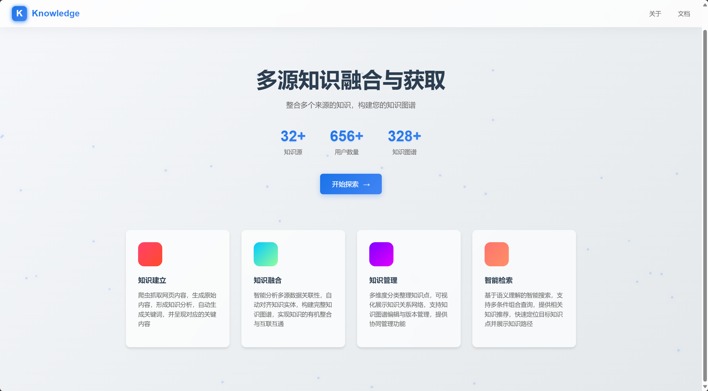
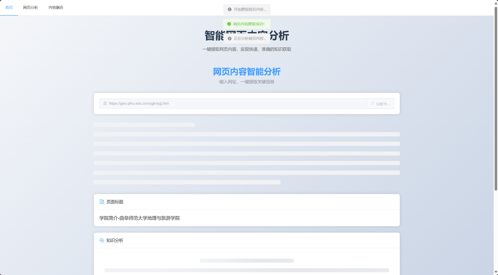
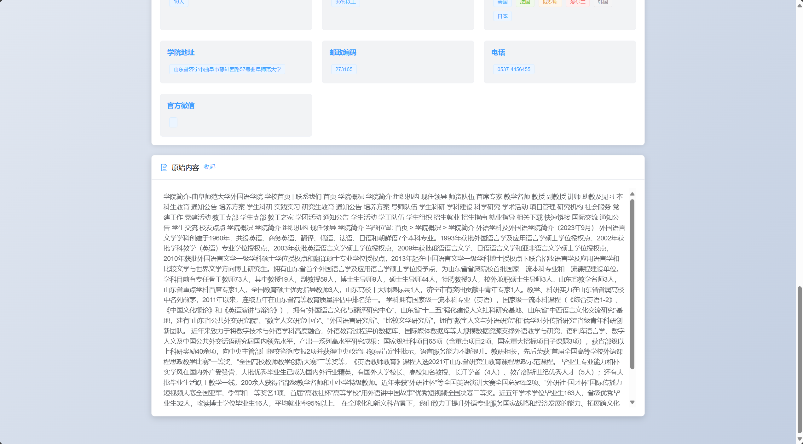
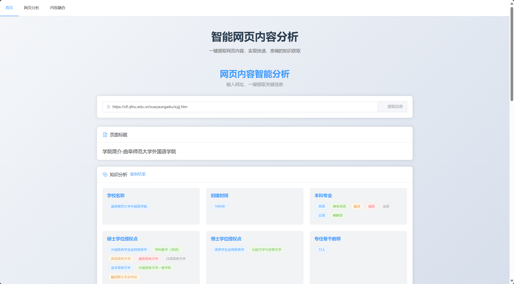
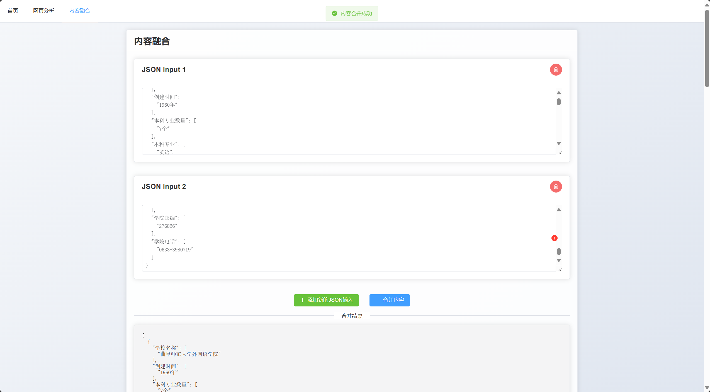

# Knowledge Management System

一个现代化的知识管理系统，支持多源知识获取、融合与智能检索。


## 功能特点

- 📚 多源知识获取：支持从多个来源爬取和整合知识
- 🔄 知识融合：智能融合不同来源的知识，构建统一的知识图谱
- 🔍 智能检索：基于先进的AI模型进行知识检索和问答
- 📊 知识管理：直观的知识管理界面，支持知识的组织与维护

## 技术栈

### 前端

- Vue 3
- TypeScript
- Element Plus
- Vue Router
- Axios
- Vite

### 后端

- FastAPI
- OpenAI API
- BeautifulSoup4
- Moonshot API
- Python 3.8+

## 项目结构

```
knoledge/
├── frontend/               # 前端项目目录
│   ├── src/               # 源代码
│   │   ├── views/         # 页面组件
│   │   │   ├── HomePage.vue       # 主页
│   │   │   ├── FusionPage.vue    # 知识融合页面
│   │   │   └── CrawlerPage.vue   # 知识获取页面
│   │   └── ...
│   ├── package.json       # 前端依赖配置
│   └── vite.config.ts     # Vite配置
│
└── backend/               # 后端项目目录
    ├── main.py           # 主程序入口
    ├── moonshot_api.py   # Moonshot API 集成
    └── requirements.txt   # Python依赖

```

## 快速开始

### 环境要求

- Node.js 16+
- Python 3.8+
- 包管理器 (npm/yarn)

### 后端设置

1. 创建并激活Python虚拟环境（推荐）
```bash
python -m venv venv
source venv/bin/activate  # Linux/Mac
venv\\Scripts\\activate   # Windows
```

2. 安装依赖
```bash
cd backend
pip install -r requirements.txt
```

3. 配置环境变量
创建 `.env` 文件并添加必要的API密钥：
```
MOONSHOT_API_KEY=your_api_key_here
```

4. 启动后端服务
```bash
python main.py
```
服务将在 http://localhost:8001 运行

### 前端设置

1. 安装依赖
```bash
cd frontend
npm install
```

2. 启动开发服务器
```bash
npm run dev
```
前端将在 http://localhost:5173 运行

### 生产环境构建

```bash
cd frontend
npm run build
```

## API文档

启动后端服务后，访问 http://localhost:8001/docs 查看完整的API文档。

## 主要功能模块

1. 知识获取
   - 支持网页内容爬取
   
   
   - 智能提取关键信息
   

2. 知识融合
   - 多源知识整合
   
   - 知识图谱构建
   

3. 知识管理
   - 知识组织
   - 知识维护

4. 智能检索
   - 基于AI的知识检索
   - 智能问答系统

## 贡献指南

欢迎提交Issue和Pull Request来帮助改进项目。

## 许可证

[MIT License](LICENSE)
