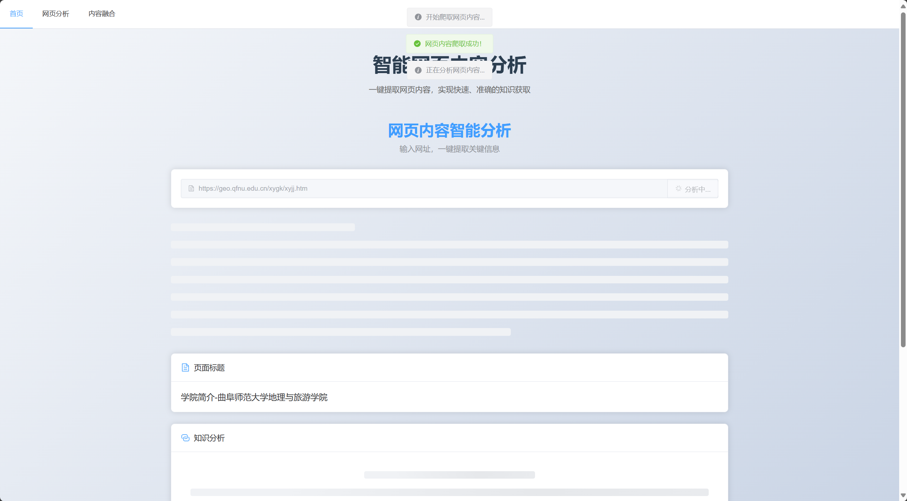
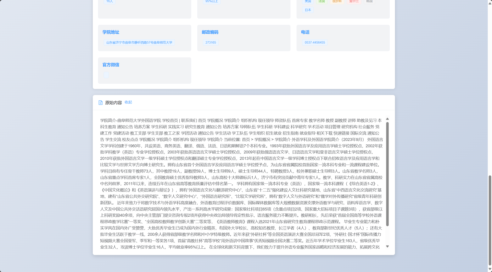
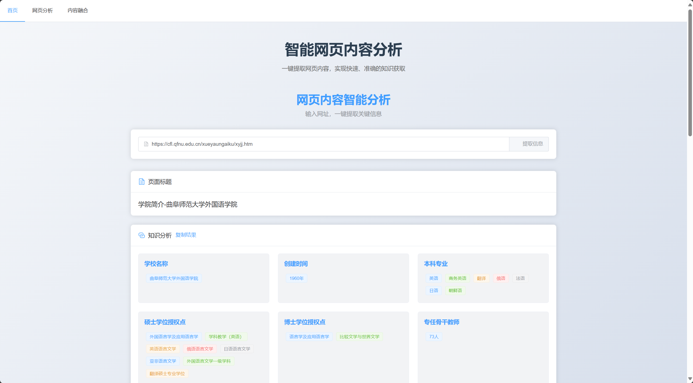
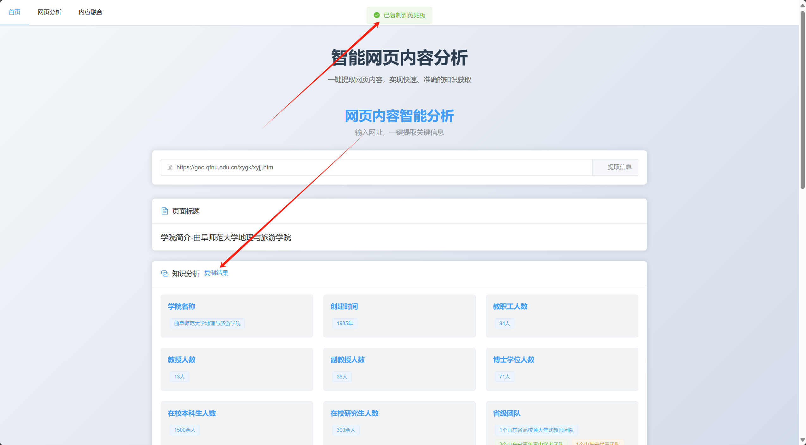
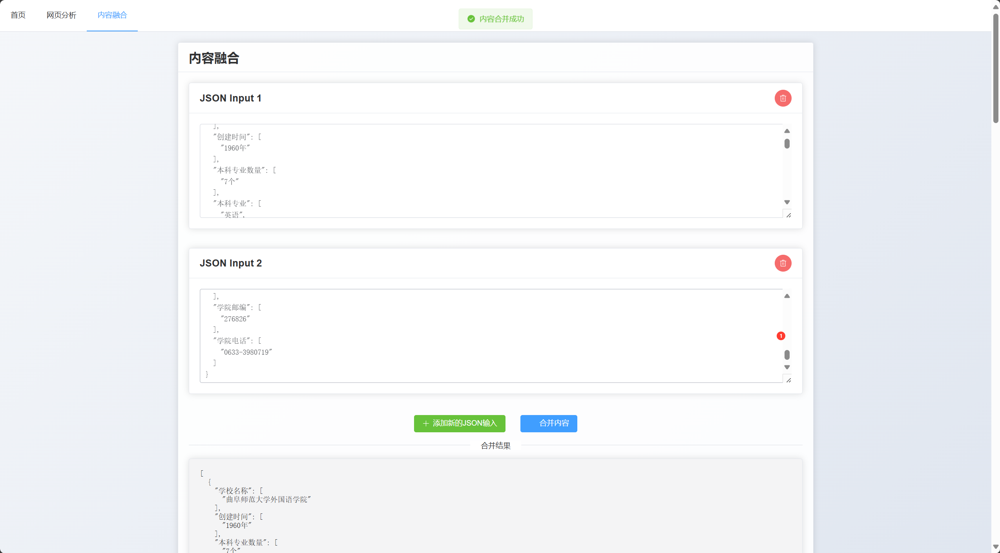

# Knowledge Management System

一个现代化的知识管理系统，支持多源知识获取、融合与智能检索。

## 功能特点

- 📚 多源知识获取：支持从多个来源爬取和整合知识
- 🔄 知识融合：智能融合不同来源的知识，构建统一的知识图谱
- 🔍 智能检索：基于先进的AI模型进行知识检索和问答
- 📊 知识管理：直观的知识管理界面，支持知识的组织与维护

## 使用指南

### 1. 知识获取
系统支持多种方式获取知识：
- **网页爬取**：输入网页URL，系统会自动提取主要内容
- **文本导入**：直接粘贴或上传文本内容
- **API对接**：支持与其他知识库系统对接

### 2. 知识融合
系统会自动对不同来源的知识进行智能融合：
- 自动去重和合并相似内容
- 建立知识点之间的关联
- 生成结构化的知识图谱

### 3. 智能检索
提供多种检索方式：
- **关键词搜索**：支持精确匹配和模糊匹配
- **自然语言问答**：直接用问题形式检索答案
- **知识推荐**：根据用户兴趣推荐相关知识

## 技术栈

### 前端
- Vue 3
- TypeScript
- Element Plus
- Vue Router
- Axios
- Vite

### 后端
- FastAPI
- OpenAI API
- BeautifulSoup4
- Moonshot API
- Python 3.8+

## 项目结构

```
knoledge/
├── frontend/               # 前端项目目录
│   ├── src/               # 源代码
│   │   ├── views/         # 页面组件
│   │   │   ├── HomePage.vue       # 主页
│   │   │   ├── FusionPage.vue    # 知识融合页面
│   │   │   └── CrawlerPage.vue   # 知识获取页面
│   │   └── ...
│   ├── package.json       # 前端依赖配置
│   └── vite.config.ts     # Vite配置
│
└── backend/               # 后端项目目录
    ├── main.py           # 主程序入口
    ├── moonshot_api.py   # Moonshot API 集成
    └── requirements.txt   # Python依赖

```

## API文档

### 后端API

#### 1. 知识爬取
```http
POST /api/crawl
Content-Type: application/json

{
    "url": "https://example.com"
}
```

#### 2. 知识融合
```http
POST /api/merge
Content-Type: application/json

{
    "contents": [
        {"title": "内容1", "content": "..."},
        {"title": "内容2", "content": "..."}
    ]
}
```

#### 3. 智能搜索
```http
POST /api/search
Content-Type: application/json

{
    "query": "搜索问题"
}
```

## 快速开始

### 环境要求
- Node.js 16+
- Python 3.8+
- 包管理器 (npm/yarn)

### 后端设置

1. 创建并激活Python虚拟环境
```bash
python -m venv venv
source venv/bin/activate  # Linux/Mac
venv\\Scripts\\activate   # Windows
```

2. 安装依赖
```bash
cd backend
pip install -r requirements.txt
```

3. 配置环境变量
创建 `.env` 文件：
```
MOONSHOT_API_KEY=your_api_key_here
```

4. 启动后端服务
```bash
python main.py
```

### 前端设置

1. 安装依赖
```bash
cd frontend
npm install
```

2. 启动开发服务器
```bash
npm run dev
```

## 常见问题

### 1. 知识爬取失败
- 检查URL是否正确
- 确认网页是否可以正常访问
- 检查网页是否有反爬虫机制

### 2. 搜索无结果
- 尝试使用不同的关键词
- 确认知识库中是否已导入相关内容
- 检查搜索语句是否准确

### 3. 系统运行慢
- 检查网络连接
- 确认系统资源是否充足
- 可能是正在处理大量数据，请耐心等待

## 使用技巧

1. **高效导入知识**
   - 优先使用结构化的文档
   - 分批导入大量内容
   - 导入前进行内容预处理

2. **优化搜索效果**
   - 使用准确的关键词
   - 利用高级搜索功能
   - 注意知识分类管理

3. **数据安全**
   - 定期备份知识库
   - 及时更新系统
   - 注意数据隐私保护

## 主要功能模块

1. 知识获取
   - 支持网页内容爬取
   
   
   - 智能提取关键信息
   

2. 知识融合
   - 多源知识整合
   
   - 知识图谱构建
   

3. 知识管理
   - 知识组织
   - 知识维护

4. 智能检索
   - 基于AI的知识检索
   - 智能问答系统

## 贡献指南

欢迎提交Issue和Pull Request来帮助改进项目。

## 许可证

[MIT License](LICENSE)
